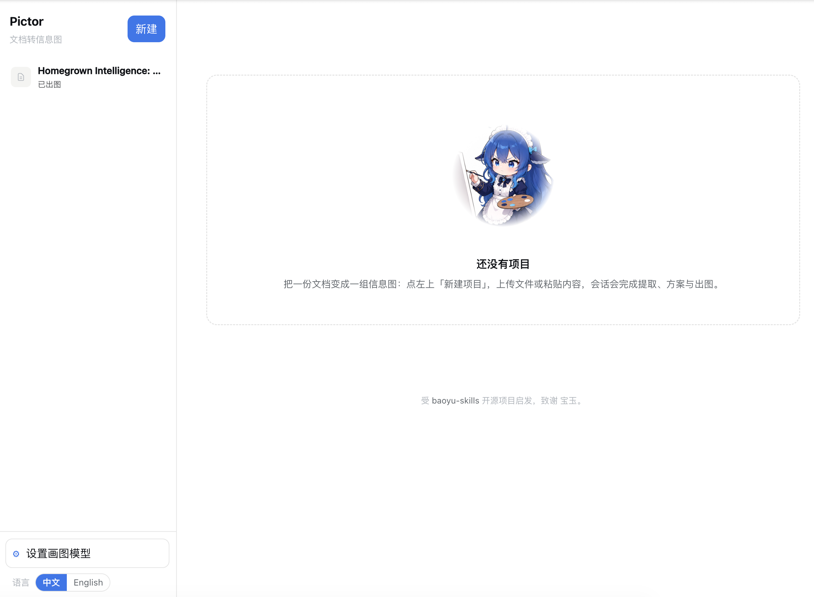
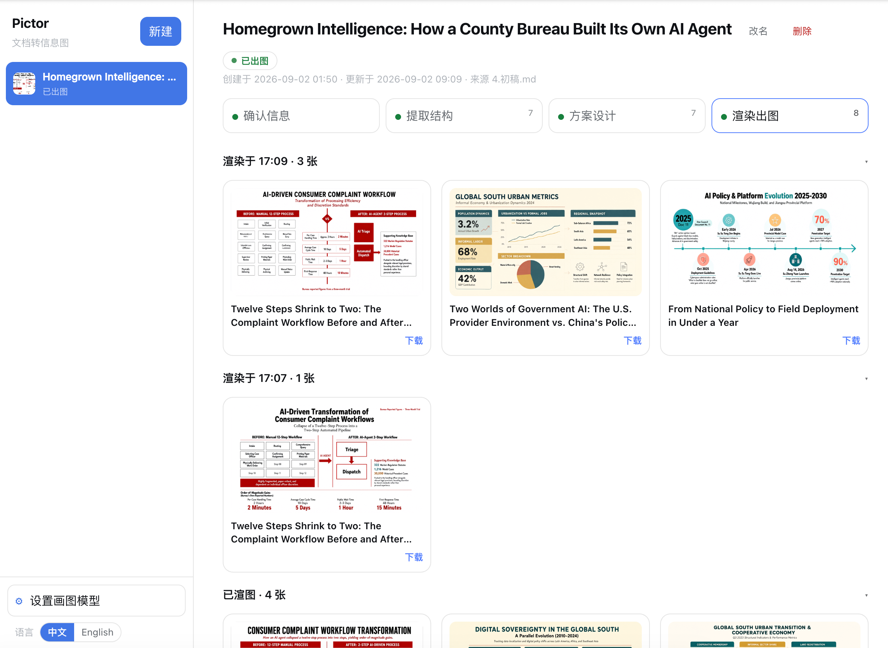

# Pictor — Document-to-Infographic Workbench

[ EN | [中文](./README.zh-cn.md) ]

Pictor turns a document into a set of infographics. It is a [DeepSeek Harness](https://github.com/deepseek-ai/deepseek-harness) (DSH) plugin published to npm as [`dsh-pictor`](https://www.npmjs.com/package/dsh-pictor), with source at [github.com/bandung-circuits/pictor](https://github.com/bandung-circuits/pictor). Each project is one coherent agent session that carries the whole extract → advise → render flow; the GUI is a thin layer that only shows file-fact state and shapes your input. Design decisions live in [docs/DESIGN.zh.md](docs/DESIGN.zh.md) (Chinese).



## Installation

Pictor is published to npm as `dsh-pictor`:

```bash
dsh plugin --profile <profile> add dsh-pictor
```

Replace `<profile>` with the target profile name (e.g. `desktop`, `web`) and start that profile. A **Pictor** button appears at the bottom-left of the dsh footer. On first use a `~/.pictor` home is provisioned and registered as a DSH workspace; project sessions group under "Pictor" in the sidebar. For development installs (local link, live-reload while editing source) see [docs/DESIGN.zh.md](docs/DESIGN.zh.md).

**For non-technical users**: install [DSH Desktop](https://dshdesktop.com/en/) (a community project, not an official DeepSeek product; it bundles the DeepSeek Harness runtime as a ready-to-run desktop app) and let the agent install the plugin for you — just send this one message in dsh:

> Install the Pictor plugin from the npm package `dsh-pictor` into the current profile, restart if needed, and confirm when a Pictor button appears at the bottom left.

## Supported dsh version

Pictor is built and tested against **DSH Desktop 0.7.2** (bundled Harness **0.1.2-alpha.1**). The DeepSeek Harness client API moves quickly — the workspace/session services it exposes keep changing — so this plugin intentionally tracks one harness generation. Other versions (older or newer) may work or may break without notice, and are outside our support scope. If something stops working after a DSH update, update dsh to the version above rather than debugging the mismatch.

## Usage

1. Open the workbench via the **Pictor** footer button and click **New project**: upload a file (`md` / `txt` / `docx` / `pdf` / image) or paste content (from Word or the web; formatting is kept, stored as sanitised HTML).
2. The session reads and normalises the source (`docx` / `pdf` / image / HTML → `document.md` via DSH tooling) and proposes candidate structures.
3. Tick the structures and confirm; the session moves to proposal design. Tick a proposal, pick an aspect ratio, and click **Render selected**.
4. Preview and download from the result grid; open the discussion panel to talk to the session at any point, or use the step bar to go back and redo existing artifacts.



## Form

- A `~/.pictor` home is created on first use (registered as a DSH workspace; sidebar shows "Pictor").
- The only entry point is the bottom-left **Pictor** footer button, which toggles a `shell.overlay` workbench: projects on the left, the selected project on the right.
- Every project has three fixed steps: extract structures → design proposals → render images. After each human decision the **same session resumes** (agent-loop resume semantics); existing artifacts are never re-derived.
- The project name is taken from the document's first line and can be renamed any time in the info bar (touches only `index.json`).
- State is driven purely by file facts; running status is authoritative via the DSH agent registry; orchestration concerns are left to the session.

## Two models

- **Reasoner**: extract and advise run on DSH's current default model — no Pictor configuration needed.
- **Image model**: configured in the workbench Settings (`seedream` / `gemini` / `openai-compatible` / `mock`). API keys go through DSH's credential subsystem; the configuration stores only a reference.

## Development & verification

```bash
npm run build                # esbuild build of host + bundled client
npm run verify               # L1 unit + L2 host integration (mock ctx, 15 items)
npm run verify:integration   # L3 transport smoke against a real dsh web (hermetic temp home)
npm run test:pack            # package integrity: tarball carries lib/, agents/, references/, assets/
npm run test:install         # L5: README install path (dsh plugin add) → real dsh web boot
npm run test:e2e             # L4a browser e2e (fixture data, deterministic)
npm run hooks:install        # one-time: enable the pre-push hook (git config core.hooksPath .githooks)
```

The pre-push hook runs `npm run verify` + `npm run test:install` before every push; all smoke layers are hermetic (temp `DSH_HOME`, never the live `~/.dsh`).

Test-layer definitions and rationale: [docs/DESIGN.zh.md](docs/DESIGN.zh.md) §7.

### Layout

```
pictor/
├── agents/                # declarative blueprints (orchestrator/extractor/advisor/renderer)
├── references/domain/     # base-prompt + layouts/ + styles/ + diagram-types/ + visual-principles
├── src/host/              # plugin host: ~/.pictor, project sessions, /pictor RPC, image generation
├── src/client/            # workbench UI (React.createElement + theme variables)
├── e2e/                   # L4a Playwright
├── verify.mjs             # L1+L2 offline smoke
└── scripts/               # build + transport-smoke
```

Data home `~/.pictor/`: `index.json` (project index), `pictor-config.json` (image-model configuration), `<project-id>/` (self-contained: agents/references snapshot + `10.input` + `11.extraction` + `12.advice` + `output`).

## Documents

- Design decisions: [docs/DESIGN.zh.md](docs/DESIGN.zh.md) (Chinese)
- Verification checklist: [docs/verification-checklist.zh.md](docs/verification-checklist.zh.md) (Chinese)

## License

MIT — see [LICENSE](LICENSE). Third-party content notices: [NOTICE.md](NOTICE.md).